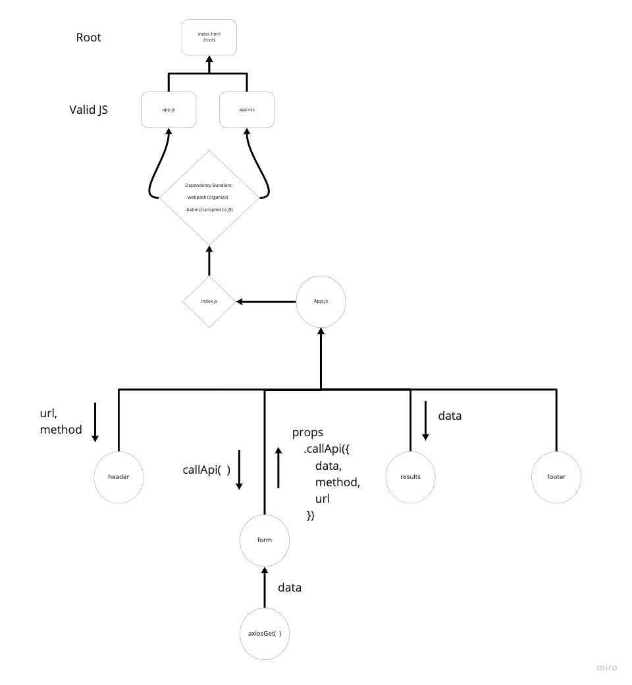

 

# RESTy

goal is to setup the basic scaffolding of the application, with intent being to add more functionality to the system as we go. This initial build sets up the file structure so that we can progressively build this application in a scalable manner

## UML

## Requirements

Phase 1: [Begin work on the RESTy API testing application](./src/assets/requirements#Phase1)
