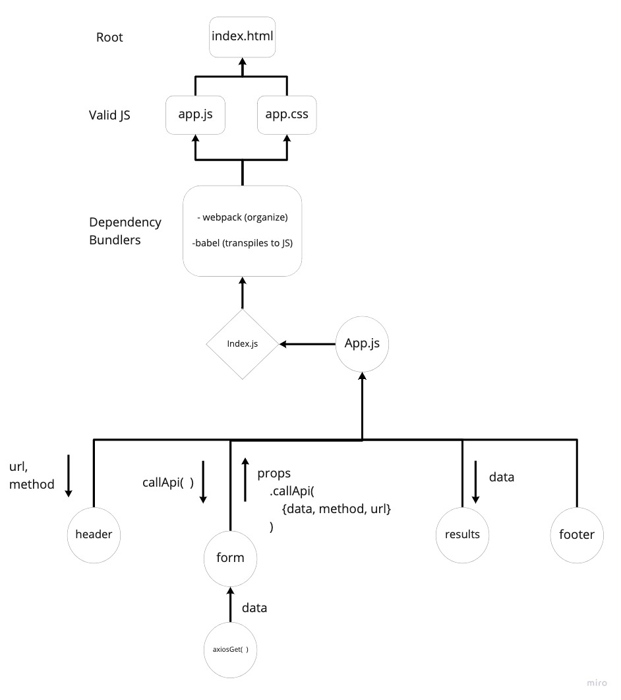

[](https://github.com/antoni909/RESTy/actions/workflows/pages/pages-build-deployment)  

<h1 align="center">Welcome to RESTy 👋</h1>

> API testing tool that can be run in any browser, allowing a user to easily interact with APIs in a familiar interface.

#  

The goal is to setup the basic scaffolding of the application, with intent being to add more functionality to the system as we go. This initial build sets up the file structure so that we can progressively build this application in a scalable manner

## UML

Phase 1 and 2: 

### Requirements

Phase 1: [Begin work on the RESTy API testing application](./src/assets/requirements#Phase1)
Phase 2: [Retrieving User Input and Managing State](./src/assets/requirements#Phase2)
Phase 3: [wip](./src/assets/requirements#Phase3)
Phase 4: [Advanced State with Reducers](./src/assets/requirements#Phase4)

#### Home : 🏠 [GitHub](https://github.com/antoni909/RESTy)

#### Deployment: ✨ [GitHub Pages](https://antoni909.github.io/RESTy/)

#### Install

```sh
npm install
```

#### Usage

```sh
npm run start
```

#### Run tests

```sh
npm run test
```

#### Author

* Website: https://github.com/antoni909
* Github: [@antoni909](https://github.com/antoni909)

#### 🤝 Contributing

Contributions, issues and feature requests are welcome!

Feel free to check [issues page](https://github.com/antoni909/RESTy/issues)

#### Show your support

Give a ⭐️ if this project helped you!

***
_This README was generated with ❤️ by [readme-md-generator](https://github.com/kefranabg/readme-md-generator)_
